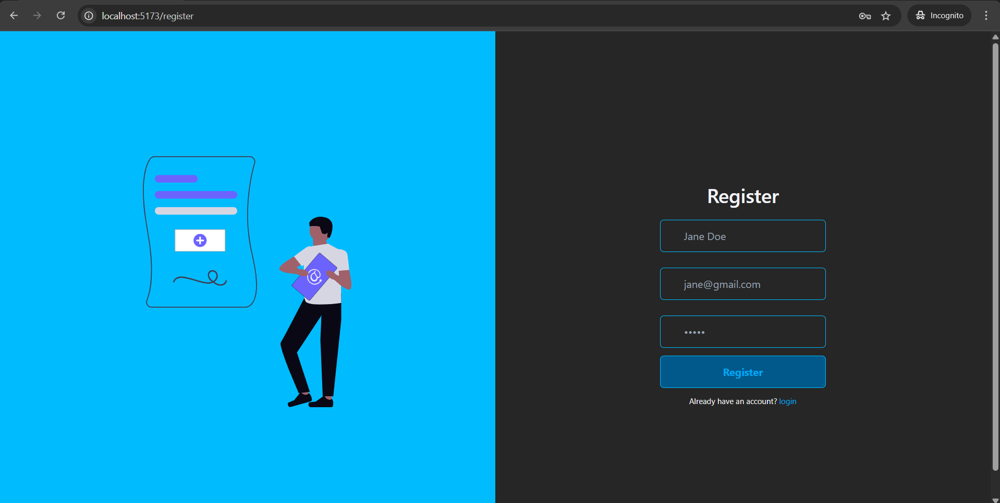
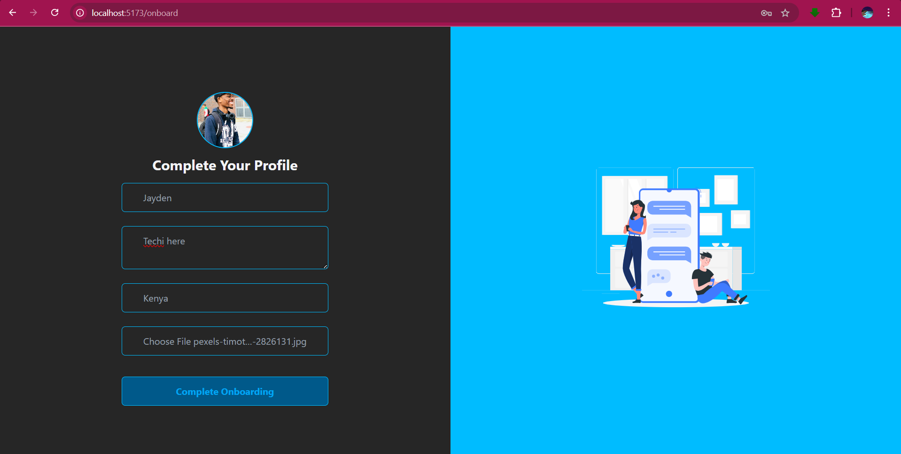
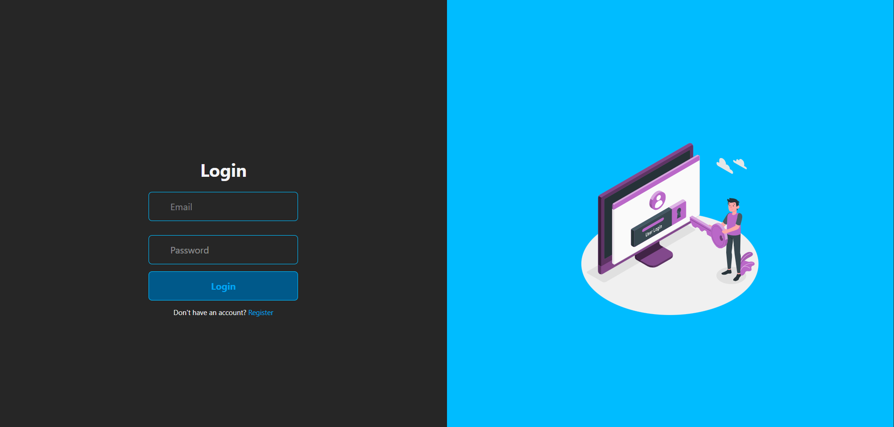
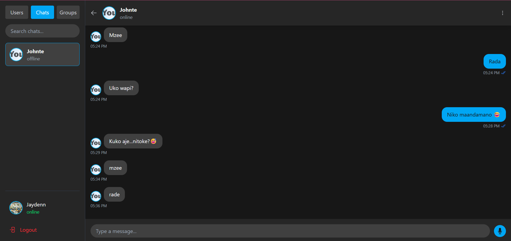
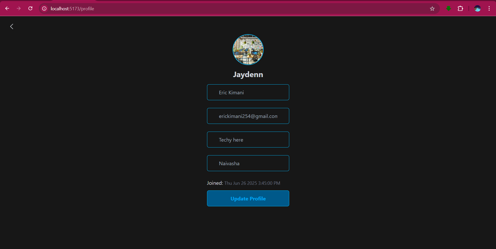
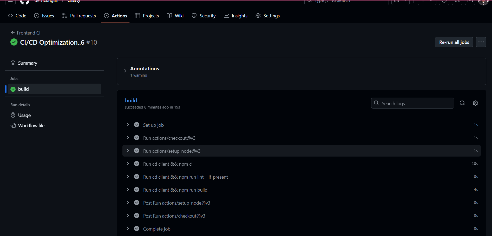
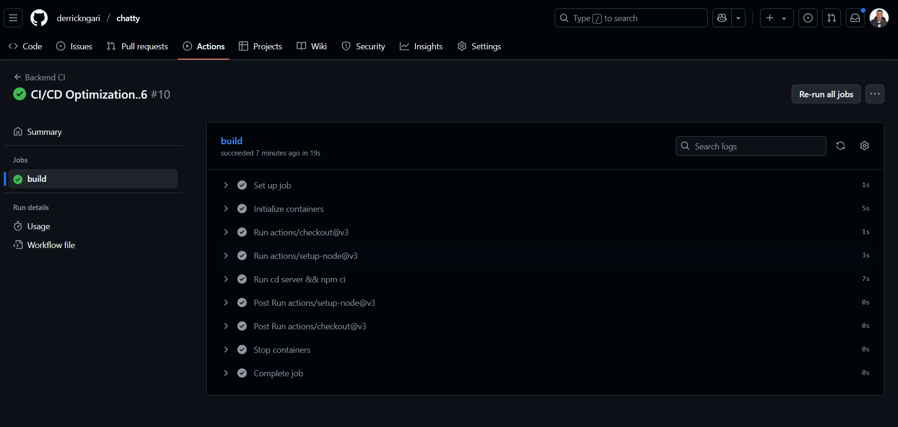
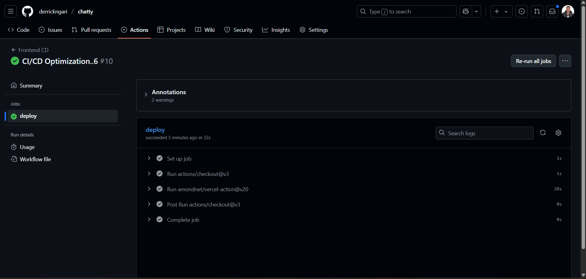
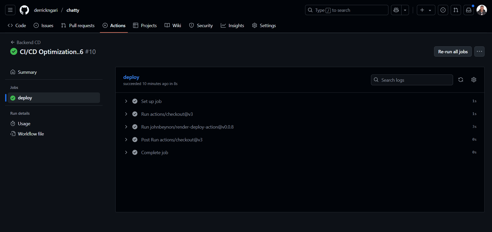

[](https://classroom.github.com/online_ide?assignment_repo_id=19825472&assignment_repo_type=AssignmentRepo)

# Real-Time Chat Application with Socket.io

A full-stack real-time chat application built with React, Node.js, Express, MongoDB, and Socket.io. The app supports private and group messaging, user authentication, online status, typing indicators, read receipts, and is fully responsive for both desktop and mobile.

---

## 🚀 Features

- **User Authentication:** Register, login, and onboarding with profile image upload.
- **Real-Time Messaging:** Instant messaging using Socket.io for both private and group chats.
- **Online Status:** See which users are online in real time.
- **Typing Indicators:** Know when someone is typing in a chat.
- **Read Receipts:** See when your messages have been read (checkmarks only for your own messages).
- **Responsive UI:** Optimized for both desktop and mobile devices.
- **Profile & Onboarding:** Complete your profile with a bio, location, and profile image.
- **Search & Filtering:** Quickly find users, chats, or groups.
- **Logout & Error Handling:** Secure session management and robust error boundaries.

---

## 📸 Screenshots

### Register


### Onboarding


### Login


### Chat Page


### Profile Page


### Frontend CI


### Backend CI


### Frontend CD


### Backend CD


---

## 🏗️ Project Structure

```
week-7-devops-deployment-assignment-derrickngari/
├── client/                 # React front-end
│   ├── public/             # Static files
│   ├── src/                # React source code
│   │   ├── components/     # UI components
│   │   ├── context/        # React context providers
│   │   ├── hooks/          # Custom React hooks
│   │   ├── pages/          # Page components
│   │   ├── socket/         # Socket.io client setup
│   │   └── App.jsx         # Main application component
│   └── package.json        # Client dependencies
├── server/                 # Node.js back-end
│   ├── config/             # Configuration files
│   ├── controllers/        # API and socket event handlers
│   ├── models/             # Data models
│   ├── socket/             # Socket.io server setup
│   ├── utils/              # Utility functions
│   ├── server.js           # Main server file
│   └── package.json        # Server dependencies
└── screenshots/            # App screenshots
```

---

## ⚙️ Environment Variables

### Client (`client/.env`)

```
VITE_SERVER_URL=https://chatty-4qoy.onrender.com/
```
- `VITE_SERVER_URL`: The base URL of your backend server (used for API and socket connections).

### Server (`server/.env`)

```
PORT=5000
CLIENT_URL=https://chatty-xi-snowy.vercel.app
MONGO_URI=your_mongodb_connection_string
CLOUDINARY_CLOUD_NAME=your_cloudinary_cloud_name
CLOUDINARY_API_KEY=your_cloudinary_api_key
CLOUDINARY_API_SECRET=your_cloudinary_api_secret
```
- `PORT`: Port for the Express server to run on (default: 5000).
- `CLIENT_URL`: The base URL of your frontend client (for CORS and socket.io).
- `MONGO_URI`: MongoDB connection string.
- `CLOUDINARY_CLOUD_NAME`, `CLOUDINARY_API_KEY`, `CLOUDINARY_API_SECRET`: Credentials for Cloudinary image uploads.

---

## 🧑‍💻 Getting Started

### Prerequisites

- Node.js (v18+ recommended)
- npm or yarn

### Setup

1. **Clone the repository:**
   ```bash
   git clone <your-repo-url>
   cd week-7-devops-deployment-assignment-derrickngari
   ```

2. **Install server dependencies:**
   ```bash
   cd server
   npm install
   ```

3. **Install client dependencies:**
   ```bash
   cd ../client
   npm install
   ```

4. **Start the development servers:**
   - In the `server` directory:
     ```bash
     npm run dev
     ```
   - In the `client` directory:
     ```bash
     npm run dev
     ```

5. **Open your browser and navigate to** `http://localhost:5173` (or the port shown in your terminal).

---

## ✨ Advanced Features Implemented

- Private and group chats
- Typing indicators
- Read receipts
- Online/offline status
- Profile onboarding with image upload (Cloudinary integration)
- Responsive design for mobile and desktop

---

## 🚀 Deployment Links

- **Frontend:** [https://chatty-xi-snowy.vercel.app](https://chatty-xi-snowy.vercel.app)
- **Backend:** [https://chatty-4qoy.onrender.com/](https://chatty-4qoy.onrender.com/)

---

## 🔄 CI/CD Pipeline

GitHub Actions are used for automated testing, building, and deployment:

- **Frontend CI:** Runs tests and builds the React app on every push/pull request.
- **Backend CI:** Runs tests and builds the Express backend on every push/pull request.
- **Frontend CD:** Deploys the frontend to Vercel on every push to `main`.
- **Backend CD:** Deploys the backend to Render on every push to `main`.
- **Health Checks:** Automated checks for backend and frontend after deployment.

See `.github/workflows/mern-ci-cd.yml` for the full pipeline configuration.

---

## 🛡️ Monitoring & Maintenance

- Health check endpoint: `/api/health` on backend.
- Uptime monitoring via GitHub Actions health-check job.
- Error tracking and logging implemented in backend.
- Regular updates and database backups recommended.

---

## 📚 Resources

- [Socket.io Documentation](https://socket.io/docs/v4/)
- [React Documentation](https://react.dev/)
- [Express.js Documentation](https://expressjs.com/)
- [GitHub Actions Documentation](https://docs.github.com/en/actions)
- [MongoDB Atlas Documentation](https://docs.atlas.mongodb.com/)
- [Render Documentation](https://render.com/docs)
- [Vercel Documentation](https://vercel.com/docs)

---

## 📝 Assignment

See `Week7-Assignment.md` for the full assignment brief and grading criteria.

---

If you deploy your app, add the deployed URLs here!  
All required screenshots are included above.